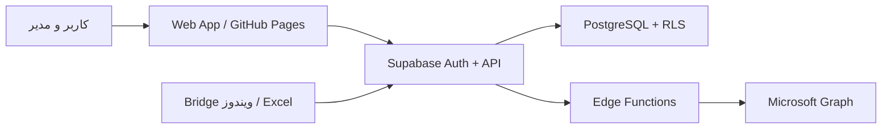

# معماری نهایی سامانه مدیریت، پایش و پیگیری امور BAMCO

نسخه سند: ۱.۰ — ۱۴۰۵/۰۶/۱۴  
مبنای بررسی: شاخه `main` در Commit `32e927768e9b7b70e04e170d6c80c5543a112f6f`

## تصمیم نهایی

معماری هدف سه‌لایه است:

1. **Web App روی GitHub Pages**: رابط فارسی و RTL، بدون نگهداری Secret و بدون دسترسی مستقیم به Outlook محلی.
2. **Supabase**: Authentication، PostgreSQL، RLS، Storage، Realtime و Edge Functions.
3. **Microsoft Graph**: ارسال ایمیل، ذخیره شناسه پیام، بررسی پاسخ‌ها و ارسال Follow-up در همان Conversation.

Bridge ویندوز و ورود مستقیم از Excel در دوره گذار حفظ می‌شوند، اما به‌عنوان مسیر سازگاری و بازیابی، نه منبع اصلی داده. منبع نهایی حقیقت PostgreSQL است.

## نتیجه ممیزی پروژه فعلی

### وضعیت اجرایی

- نسخه زنده GitHub Pages و `index.html` شاخه `main` از نظر SHA-256 یکسان‌اند.
- برنامه یک Static Web App بدون Build System و Package Lock است.
- اجرای اصلی از `webapp.js` آغاز می‌شود؛ این فایل چهار Part را با `fetch` می‌خواند و با `Function(source)()` اجرا می‌کند.
- منبع داده اجرایی فعلی فایل Excel است که از طریق سرویس محلی Python روی `127.0.0.1` خوانده می‌شود.
- ارسال Outlook، پیگیری پاسخ و مدیریت استیکر نیز عمدتاً از طریق Bridge محلی انجام می‌شود.
- `app.js` و `manager.js` دارای پیاده‌سازی Supabase/Auth/Graph هستند، اما در `index.html` فعلی بارگذاری نمی‌شوند.
- SQLهای Phase 3 و Phase 4 فقط افزایشی‌اند و Baseline کامل قابل بازسازی برای یک محیط خالی ارائه نمی‌کنند.

### قابلیت‌هایی که باید بدون حذف حفظ شوند

| حوزه | قابلیت‌های موجود/مرجع | مقصد نهایی |
|---|---|---|
| ورود | ورود با ایمیل و رمز، تغییر اجباری رمز در ورود نخست | Supabase Auth + پروفایل |
| دسترسی | مدیر همه داده‌ها؛ متولی فقط داده‌های خودش | RLS در PostgreSQL |
| کارها | کانبان، آرشیو، افزودن و ویرایش، Excel Import/Export | `tasks` + RPCهای کنترل‌شده |
| تأیید | تغییرات متولی فقط پس از تأیید مدیر | `change_requests` + RPC تراکنشی |
| داشبورد | کارت‌ها، نمودارها، فیلترها، تاخیر و تعجیل | Viewهای RLS-aware |
| افراد | نام، ایمیل، جنسیت، عنوان، رونوشت، فعال/غیرفعال | `profiles` و `profile_cc` |
| ایمیل | ۵ وضعیت، پیش‌نمایش، ارسال مستقیم، استیکر | Edge Function + Graph |
| پیگیری | تشخیص پاسخ، بدون پاسخ، یادآوری در همان رشته | Webhook/Delta + Graph reply |
| تنظیمات | متن‌ها، تأخیر ارسال، تنظیمات سامانه | جداول تنظیمات با RLS |
| استیکر | نسخه‌ها، ۵ حالت × ۲ جنسیت، نسخه فعال | Storage خصوصی + Metadata |
| سازگاری | خواندن فایل TM و Outlook Desktop | Bridge در دوره گذار |

## ریسک‌های فعلی که باید قبل از Cutover بسته شوند

1. **دو منبع حقیقت**: Excel/Bridge و Supabase می‌توانند داده متفاوت نشان دهند.
2. **Graph در Browser**: جریان Implicit Token و نگهداری Access Token در `sessionStorage` مناسب تولید نیست؛ Token باید فقط سمت سرور نگهداری شود.
3. **پیگیری ناقص Reply**: کد قدیمی Message-ID/Conversation-ID را هنگام ارسال به‌صورت قابل اتکا ثبت نمی‌کند.
4. **RLS ناقص/پراکنده**: Phaseهای موجود Baseline کامل Schema و تمام Policyها را ندارند.
5. **نقش بر اساس ایمیل Hard-code**: نقش مدیر نباید در Trigger بر مبنای دو ایمیل ثابت تعیین شود.
6. **Storage عمومی استیکرها**: Bucket فعلی Public تعریف شده؛ هدف نهایی Bucket خصوصی و Signed URL است.
7. **اجرای کد با `Function`**: CSP سخت‌گیرانه را ناممکن و ممیزی امنیتی را دشوار می‌کند.
8. **تنظیمات حساس**: Tenant/Client configuration نباید قابل ویرایش آزاد یا قابل خواندن برای متولی باشد.

## Schema نهایی

### هویت و مجوز

- `profiles`: یک‌به‌یک با `auth.users`؛ نقش، نام نمایشی، وضعیت، جنسیت، عنوان ایمیل و اجبار تغییر رمز.
- نقش‌ها: `admin`، `manager`، `owner` و `auditor`.
  - `admin`: مدیریت کاربران، نقش‌ها و تنظیمات امنیتی.
  - `manager`: مشاهده همه کارها، ثبت مستقیم، بررسی درخواست‌ها، ایمیل و گزارش.
  - `owner`: مشاهده کارهای خودش و ثبت درخواست تغییر برای خودش.
  - `auditor`: مشاهده همه داده‌های عملیاتی، بدون ویرایش.
- `profile_cc`: رونوشت‌های چندتایی و مرتب‌شده؛ جایگزین امن‌تر برای آرایه متنی.

### کارها و گردش تأیید

- `tasks`: رکورد اصلی کار؛ شناسه عمومی ترتیبی، شناسه قدیمی Excel، مالک، وضعیت، اولویت، تاریخ‌ها، یادآور و آرشیو.
- `task_events`: تاریخچه Append-only برای ایجاد، تغییر، انتقال مالک، آرشیو و Restore.
- `change_requests`: Snapshot کامل Before/Proposed، وضعیت و اطلاعات بررسی.
- `review_change_request()`: تنها مسیر تأیید/رد؛ Row Lock و تراکنش اتمیک.

### ایمیل و Microsoft Graph

- `email_templates`: موضوع و HTML نسخه‌بندی‌شده برای ۵ حالت و Follow-up.
- `email_dispatches`: یک Batch ارسال با وضعیت و شمارنده‌ها.
- `email_messages`: یک رکورد برای هر گیرنده؛ `graph_message_id`، `internet_message_id`، `conversation_id` و وضعیت پاسخ.
- `graph_connections`: فقط Metadata اتصال؛ Refresh Token در Secret Store سرور، نه جدول و نه Browser.
- `graph_subscriptions`: Subscription و Delta Link صندوق ورودی برای Sync افزایشی.

### فایل‌ها، استیکرها و تنظیمات

- `sticker_packs` و `sticker_assets`: نسخه و کلید Storage هر یک از ۱۰ تصویر.
- `app_settings`: فقط تنظیمات غیرمحرمانه و Typed.
- `import_jobs` و `import_rows`: ثبت Import، Hash فایل، خطاهای سطری و امکان Dry Run.
- `audit_log`: رخدادهای امنیتی و مدیریتی غیرقابل‌ویرایش از Client.

## قواعد RLS نهایی

| جدول | owner | manager | admin | auditor |
|---|---|---|---|---|
| `profiles` | مشاهده و ویرایش فیلدهای شخصی خودش از RPC | مشاهده همه، ویرایش Metadata غیرنقشی | کامل | مشاهده |
| `tasks` | فقط `owner_id = auth.uid()`، بدون Write مستقیم | CRUD همه | CRUD همه | Select همه |
| `change_requests` | Select/Create درخواست خودش برای کار خودش | Select و Review از RPC | کامل | Select |
| `task_events` | Select رخداد کار خودش | Select همه | Select همه | Select همه |
| Email/Template/Sticker | بدون دسترسی، مگر پیش‌نمایش داده خودش از RPC | مدیریت | مدیریت | Select Log |
| Settings/Graph | بدون دسترسی | تنظیمات غیرمحرمانه و عملیات مجاز | کامل | Select غیرمحرمانه |

اصول اجباری:

- Client هرگز `service_role` دریافت نمی‌کند.
- تمام Viewها `security_invoker=true` هستند.
- تمام Functionهای `security definer` دارای `search_path` ثابت، بررسی نقش درون تابع و حداقل Grant هستند.
- متولی هیچ `insert/update/delete` مستقیمی روی `tasks` ندارد.
- تغییر نقش فقط از مسیر Admin انجام می‌شود، نه با Update عمومی پروفایل.
- حذف فیزیکی Task در UI وجود ندارد؛ Archive/Restore و Audit استفاده می‌شود.

## معماری صحیح Microsoft Graph

### احراز هویت

- App Registration سازمانی با Authorization Code + PKCE.
- Callback به Supabase Edge Function.
- Refresh Token رمزگذاری‌شده در Secret Store یا Vault سمت سرور.
- Scope حداقلی Delegated: `Mail.Send`، `Mail.Read` و در صورت نیاز `offline_access`.
- Tenant و Client ID عمومی قابل تنظیم‌اند؛ Client Secret و Refresh Token هرگز وارد DB عمومی یا Frontend نمی‌شوند.

### ارسال و پیگیری

1. Web App درخواست ارسال را به Edge Function می‌دهد.
2. Function نقش مدیر، گیرندگان، Rate Limit و Idempotency Key را بررسی می‌کند.
3. برای دریافت ID، پیام ابتدا Draft ساخته، سپس ارسال می‌شود.
4. شناسه‌های Graph، Internet Message-ID و Conversation-ID ثبت می‌شوند.
5. Webhook فقط Notification را می‌پذیرد؛ Sync واقعی با Delta Query انجام می‌شود.
6. پاسخ بر اساس `conversationId` و Headerهای Reply تطبیق داده می‌شود.
7. Follow-up با Reply/ReplyAll روی همان پیام یا Conversation ارسال می‌شود؛ ارسال موضوع مشابه به‌عنوان ایمیل جدید ممنوع است.

## مسیر Migration بدون حذف قابلیت

### M0 — Freeze و Backup

- Mirror کامل Git، Snapshot دیتابیس، Export کاربران Auth، Export Bucketها و نسخه Excel مرجع.
- ثبت Commit/Hash نسخه زنده.
- ممنوعیت تغییر مستقیم Production تا پایان Dry Run.

### M1 — Baseline امن

- اجرای Migration در Supabase Staging.
- ایجاد Schema جدید، RLS، RPC و Audit بدون حذف جداول فعلی.
- ساخت Compatibility View برای نام‌ها و ستون‌های قدیمی.

### M2 — Data Import با Dry Run

- واردکردن Profiles و نگاشت نام Excel به UUID.
- Import کانبان و آرشیو با `source_row_hash` برای Idempotency.
- گزارش رکوردهای تکراری، مالک نامشخص و تاریخ نامعتبر؛ هیچ Skip خاموش مجاز نیست.
- تطبیق شمارش کل، شمارش هر متولی، مجموع دیرکرد/تعجیل و بالاترین شناسه.

### M3 — Shadow Read

- Web App همچنان Bridge را نمایش می‌دهد، ولی Supabase را نیز در پس‌زمینه می‌خواند.
- اختلاف‌ها ثبت می‌شوند؛ UI کاربر تغییر نمی‌کند.

### M4 — Supabase Primary / Bridge Fallback

- خواندن کانبان، آرشیو، داشبورد، افراد، قالب‌ها و استیکرها از Supabase.
- Excel Import/Export و Bridge Outlook همچنان قابل استفاده‌اند.
- تغییرات متولی فقط با Change Request؛ مدیر مستقیم می‌نویسد.

### M5 — Graph Pilot

- اتصال فقط برای مدیر منتخب و ارسال به چند حساب آزمایشی.
- تأیید ثبت Message-ID، Conversation-ID، Reply detection و Follow-up رشته‌ای.
- Bridge مسیر Fallback باقی می‌ماند.

### M6 — Cutover کنترل‌شده

- Graph مسیر اصلی؛ Bridge با Feature Flag قابل فعال‌سازی.
- Excel خروجی و ورودی سازگاری است، نه منبع حقیقت.
- پس از دو چرخه کاری موفق، Legacy فقط Read-only می‌شود؛ حذف آن پروژه جداگانه و نیازمند تأیید است.

## Rollback

- هر مرحله Feature Flag مستقل دارد: `data_source`, `mail_provider`, `reply_tracker`.
- Rollback نرم با برگرداندن Flag انجام می‌شود؛ Schema جدید Drop نمی‌شود.
- Migrationها فقط Forward هستند؛ اصلاح با Migration جدید انجام می‌شود.
- قبل و بعد از هر مرحله شمارش و Hashهای تطبیقی ثبت می‌شوند.

## معیار پذیرش Cutover

- شمارش کانبان و آرشیو، هر متولی و هر وضعیت با Excel مرجع دقیقاً برابر باشد.
- متولی با درخواست مستقیم REST نتواند کار دیگران را ببیند یا Task را تغییر دهد.
- Manager و Admin طبق ماتریس مجوز عمل کنند؛ Auditor هیچ Write نداشته باشد.
- هر ایمیل دقیقاً یک Log با Idempotency Key، شناسه Graph و زمان ارسال داشته باشد.
- Reply و Follow-up روی همان Conversation تأیید شود.
- داشبورد برای مدیر همه داده و برای متولی فقط داده شخصی نشان دهد.
- همه قابلیت‌های فهرست‌شده در جدول حفظ قابلیت، تست پذیرش داشته باشند.

## ترتیب اجرای بسته SQL

1. `migrations/001_target_schema.sql`
2. ورود داده با Dry Run و گزارش تطبیق
3. فعال‌سازی Feature Flagها در Staging
4. تست نفوذ RLS با حساب‌های owner/manager/admin/auditor
5. اجرای همان Migration بررسی‌شده در Production

این سند طراحی را نهایی می‌کند، اما اجرای SQL روی Production و تغییر شاخه `main` عمداً در این مرحله انجام نشده است.
